# 🎨 Frontend Ciego — Motor de Decisiones (Angular)

> **Interfaz reactiva y desacoplada para la evaluación de patrones de diseño y decisiones arquitectónicas.**

---

# 🧱 Filosofía de Diseño (Cliente Ciego)

Esta aplicación en **Angular Standalone** sigue el principio estricto de **Cliente Ciego**, donde toda la lógica de negocio reside exclusivamente en el backend.

## Principios

- **Sin lógica de negocio en el cliente:** La interfaz no evalúa respuestas, no calcula puntajes y no toma decisiones de negocio, evitando manipulaciones desde las DevTools (F12).
- **Componentes puros:** El HTML únicamente representa el estado utilizando Angular Standalone y el nuevo Control Flow (`@if`, `@for`).
- **Comunicación desacoplada:** Los componentes consumen servicios especializados sin conocer la implementación del backend.
- **Seguridad automatizada (DRY):** Un `HttpInterceptor` agrega automáticamente el encabezado:

```http
Authorization: Bearer <JWT>
```

a todas las solicitudes protegidas, evitando duplicación de código.

---

# 📊 Flujo de Comunicación End-to-End

```mermaid
graph LR

    classDef frontend fill:#dd0031,stroke:#ffffff,stroke-width:2px,color:#ffffff;
    classDef security fill:#fbc02d,stroke:#ffffff,stroke-width:2px,color:#000000;
    classDef backend fill:#6db33f,stroke:#ffffff,stroke-width:2px,color:#ffffff;
    classDef user fill:#8e44ad,stroke:#ffffff,stroke-width:2px,color:#ffffff;

    U((🧑‍🎓 Alumno)):::user

    subgraph ANGULAR["Frontend Ciego (Angular)"]
        HTML["🖼️ app.component.html<br/>Vista Reactiva"]:::frontend
        TS["⚙️ app.component.ts<br/>Controlador de Eventos"]:::frontend
        SERVICE["🚚 leccion.service.ts<br/>Cliente HTTP"]:::frontend
    end

    subgraph SECURITY["Seguridad"]
        INTERCEPTOR["🦾 auth.interceptor.ts<br/>Inyección Automática JWT"]:::security
    end

    subgraph BACKEND["Spring Boot"]
        API["🧠 Controller → Service<br/>Motor de Decisiones"]:::backend
    end

    U -->|1. Selecciona respuesta| HTML
    HTML -->|2. Envía evento| TS
    TS -->|3. Construye RespuestaDTO| SERVICE
    SERVICE -->|4. HTTP POST| INTERCEPTOR
    INTERCEPTOR -->|5. Authorization Bearer JWT| API
    API -->|6. FeedbackDTO| HTML
```



---

# 🚀 Desarrollo

## Servidor de desarrollo

Iniciar la aplicación en modo desarrollo:

```bash
ng serve
```

La aplicación estará disponible en:

```
http://localhost:4200/
```

---

## Compilación

Generar la versión de producción:

```bash
ng build
```

Los archivos compilados se almacenarán en:

```
dist/
```

---

# 🏗️ Arquitectura

```
┌───────────────┐
│     Usuario   │
└───────┬───────┘
        │
        ▼
┌──────────────────────────┐
│ Angular Standalone       │
│  • Componentes           │
│  • Templates             │
│  • Servicios HTTP        │
└───────────┬──────────────┘
            │
            ▼
┌──────────────────────────┐
│ HttpInterceptor          │
│  • JWT                   │
│  • Seguridad             │
└───────────┬──────────────┘
            │
            ▼
┌──────────────────────────┐
│ Spring Boot              │
│  • Controllers           │
│  • Services              │
│  • Motor de Decisiones   │
└──────────────────────────┘
```

---

# ✅ Beneficios de la Arquitectura

- Cliente completamente desacoplado de las reglas de negocio.
- Seguridad centralizada mediante `HttpInterceptor`.
- Componentes reutilizables y de responsabilidad única.
- Comunicación REST limpia mediante DTOs.
- Arquitectura escalable y mantenible.
- Compatible con Angular Standalone y Control Flow moderno.
- Evita la manipulación de reglas de negocio desde el navegador.

---

# 🧠 Fundamentación

Esta estrategia implementa una arquitectura donde el **frontend actúa únicamente como cliente de presentación**, mientras que el **backend concentra toda la lógica de negocio y las decisiones arquitectónicas**.

Este enfoque proporciona:

- Separación estricta de responsabilidades.
- Mayor seguridad al impedir que el cliente calcule resultados.
- Facilidad para evolucionar la lógica del sistema sin modificar la interfaz.
- Documentación alineada con buenas prácticas empresariales y arquitecturas REST modernas.
